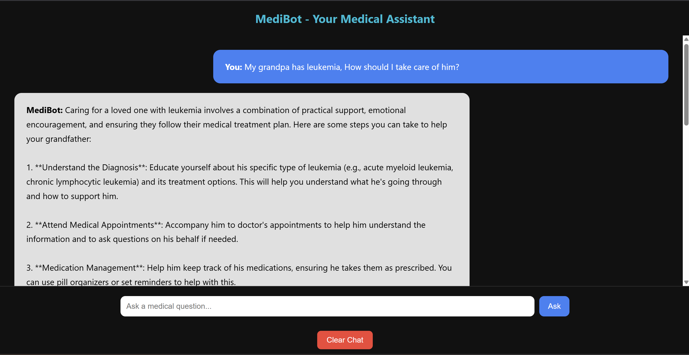
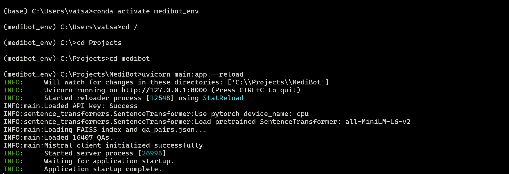

#  MediBot – Medical Q&A Chatbot Using FAISS and Mistral AI

MediBot is a lightweight medical chatbot that answers user questions using semantic search over the **MedQuAD dataset** and AI-generated responses from **Mistral**. It uses a **FAISS index** to retrieve the most relevant Q&A context and builds prompts dynamically for high-quality answers.

---

##  Demo

###  Chat UI



###  Terminal Startup



---

##  Features

-  FAISS-powered semantic search over the MedQuAD dataset
-  Uses `sentence-transformers` for embedding queries and Q&As
-  Simple, responsive chat interface with HTML/CSS/JS
-  FastAPI backend for performance
-  Secure API key handling via `.env`

---

##  Project Structure

<pre>

├── main.py                  # FastAPI backend logic  
├── prepare_medquad.py       # Script to generate FAISS index and JSON  
├── faiss_medquad.index      # Precomputed FAISS index (can be regenerated)  
├── qa_pairs.json            # Extracted Q&A pairs from MedQuAD  
├── Templates/  
│   └── index.html           # Frontend chat UI  
├── static/  
│   ├── chat-demo.png        # Screenshot of UI  
│   └── startup.png          # Screenshot of terminal  
├── .env.example             # Template for your Mistral API key  
├── .gitignore               # Git ignore rules  
├── requirements.txt         # Python dependencies  
└── README.md                # This file  

</pre>


---

##  Setup Instructions

### 1. Clone the Repository

```bash
git clone https://github.com/yourusername/MediBot.git
cd MediBot
```

### 2. Create and Activate a Virtual Environment

```bash
# On Windows:
python -m venv venv
venv\Scripts\activate

# On macOS/Linux:
python3 -m venv venv
source venv/bin/activate
```

### 3. Install Dependencies

```bash
pip install -r requirements.txt
```

---

##  API Key Setup

Create a `.env` file based on `.env.example` and add your Mistral API key:

```env
MISTRAL_API_KEY=your-mistral-api-key-here
```

---

##  Run the App

```bash
uvicorn main:app --reload
```

Then open: [http://127.0.0.1:8000](http://127.0.0.1:8000)

---

##  Regenerate FAISS Index (Optional)

```bash
python prepare_medquad.py
```

Make sure the MedQuAD data is present in the correct directory format.

---

##  Technologies Used

- [FastAPI](https://fastapi.tiangolo.com/)
- [FAISS](https://github.com/facebookresearch/faiss)
- [SentenceTransformers](https://www.sbert.net/)
- [Mistral API](https://docs.mistral.ai/)
- HTML, CSS, JavaScript (no frontend framework)

---


##  Author & Credits

Created by [Srivatsa Adharapurapu](https://github.com/Srivatsa180717)

### Dataset Attribution

This project uses the [MedQuAD Dataset](https://github.com/abachaa/MedQuAD.git) by [abachaa], licensed under the [Creative Commons Attribution 4.0 International License](https://creativecommons.org/licenses/by/4.0/).

Changes: Preprocessing, QA pair generation and Vector embedding using Sentence Transformers were performed for project purposes.

### Model Attribution

- **Mistral AI** – https://mistral.ai/  
- **SentenceTransformer “all‑MiniLM‑L6‑v2”** – https://www.sbert.net/

---

##  License

This project is licensed under the [MIT License](LICENSE)

